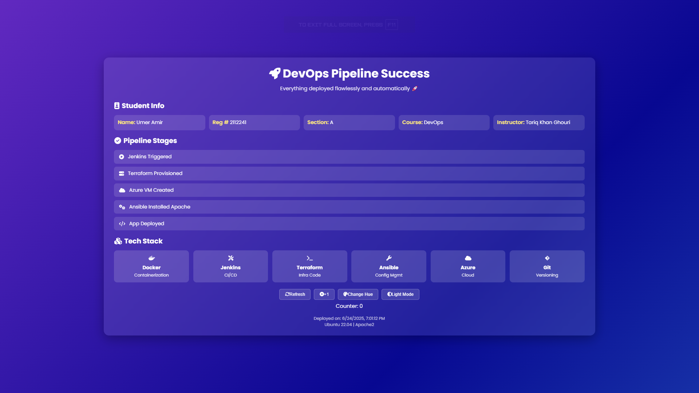

# DevOps Mega Project: Automated Infrastructure Pipeline

This project implements a fully automated DevOps pipeline using Jenkins (in Docker) that provisions Azure infrastructure with Terraform, configures it with Ansible, and deploys a static web application. This README documents both the setup process and the challenges we encountered along the way.



## 🚀 Technology Stack

- **Docker** - Containerized Jenkins with all required tools
- **Jenkins** - Pipeline automation
- **Terraform** - Infrastructure as Code for Azure
- **Ansible** - Configuration management and deployment
- **Azure** - Cloud infrastructure
- **Git** - Version control

## 📁 Project Structure

```
project/
├── terraform/
│   ├── main.tf          # Azure infrastructure configuration
│   ├── variables.tf     # Terraform variable definitions
│   └── terraform.tfvars # Variable values (gitignored)
├── ansible/
│   └── install_web.yml  # Web server configuration playbook
├── app/
│   └── index.html      # Static web application
├── logs/               # Execution logs for debugging
│   ├── 22nd Build Success.txt
│   └── 25th Build Success.txt
├── Screenshots/
├── Dockerfile          # Custom Jenkins image with tools
├── Jenkinsfile        # Pipeline definition
├── Project.png
└── .gitignore        # Git ignore patterns
```

## 🔧 Setup Instructions

### Prerequisites

- Windows machine with Docker Desktop
- Azure subscription
- GitHub account
- VS Code (recommended)

### Initial Setup

1. Clone this repository:

   ```bash
   git clone https://github.com/your-username/DevOps-Mega-Project.git
   cd DevOps-Mega-Project
   ```

2. Generate SSH key pair for VM access:

   ```bash
   ssh-keygen -t rsa -b 4096 -f ./ssh_key -N ""
   ```

3. Create Azure Service Principal:

   ```bash
   az ad sp create-for-rbac --name "DevOpsPipeline" --role contributor
   ```

4. Build and start Jenkins container:

   ```bash
   docker build -t jenkins-devops .
   docker run -d --name jenkins-devops \
     -p 8080:8080 -p 50000:50000 \
     -v jenkins_home:/var/jenkins_home \
     jenkins-devops
   ```

5. Configure Jenkins:
   - Install suggested plugins
   - Create pipeline job pointing to your repository
   - Add credentials:
     - Azure service principal (as Secret text)
     - SSH private key (as Secret file)

## 📊 Logging and Debugging

The project includes a comprehensive logging system to help with troubleshooting and debugging:

1. **Pipeline Logs**:
   - General pipeline execution logs in `logs/pipeline/`
   - Stage-by-stage execution details
   - Error messages and stack traces

You can check these logs at any time during or after pipeline execution to understand what happened and debug any issues that arise.

## 🚨 Challenges & Solutions

### 1. Terraform Provider Issues

- **Challenge**: Large provider binary (227MB) causing GitHub push failures
- **Solution**:
  - Added `.terraform` to `.gitignore`
  - Used `git filter-branch` to clean history
  - Providers now downloaded during pipeline execution

### 2. Network Security Group (NSG) Configuration

- **Challenge**: SSH access blocked by default
- **Solution**:
  - Added explicit NSG rule for SSH (port 22)
  - Configured source IP restriction
  - Added HTTP rule for web access (port 80)

### 3. SSH Key Management

- **Challenge**: SSH key permissions and distribution
- **Solution**:
  - Generate keys during pipeline
  - Store private key in Jenkins credentials
  - Set correct permissions (chmod 600) before use
  - Inject public key into VM during provisioning

### 4. Ansible Connection Issues

- **Challenge**: Ansible failing to connect to new VM
- **Solution**:
  - Added wait for VM to be fully ready
  - Implemented SSH connection retry logic
  - Fixed host key checking issues

### 5. Pipeline Idempotency

- **Challenge**: Pipeline failing on reruns
- **Solution**:
  - Added resource naming strategy
  - Implemented proper cleanup in Terraform
  - Made Ansible playbooks idempotent

### 6. Docker and WSL Integration Issues

- **Challenge**: Jenkins container couldn't properly communicate with Terraform through WSL
- **Solution**:
  - Created custom Dockerfile to package all tools (Terraform, Ansible, Azure CLI) directly in the container
  - Eliminated dependency on WSL-based tool execution
  - Added proper environment setup in Dockerfile
  - Ensured all tools run natively within the container

## 🏃‍♂️ Running the Pipeline

1. Fork this repository

2. Set up required credentials in Jenkins:

   - `AZURE_CLIENT_ID`
   - `AZURE_CLIENT_SECRET`
   - `AZURE_SUBSCRIPTION_ID`
   - `AZURE_TENANT_ID`
   - `SSH_PRIVATE_KEY`

3. Create a new pipeline job:

   - Point to your forked repository
   - Use the Jenkinsfile from repository

4. Run the pipeline!

The pipeline will:

1. Authenticate with Azure
2. Provision VM using Terraform
3. Wait for VM to be ready
4. Configure web server using Ansible
5. Deploy the static website
6. Verify deployment

## 📝 Notes

- Default VM size: Standard_DS1_v2 (can be changed in terraform.tfvars)
- Region: East US (configurable)
- OS: Ubuntu 20.04 LTS
- Web server: Apache2

## 🧹 Cleanup

To destroy all created resources:

1. Run the "Destroy Infrastructure" stage in Jenkins, or
2. Run `terraform destroy` manually

## 🔒 Security Notes

- NSG is configured to allow SSH from pipeline IP only
- All sensitive data is stored in Jenkins credentials
- SSH keys are generated per-deployment
- HTTP access is restricted to web application port only

## 🤝 Contributing

Feel free to submit issues and enhancement requests!

## ⚠️ Troubleshooting

1. If pipeline fails with SSH errors:

   - Check NSG rules
   - Verify SSH key permissions
   - Ensure VM is fully provisioned

2. If Terraform fails:

   - Check Azure credentials
   - Verify resource name availability
   - Check quota limits

3. If Ansible fails:
   - Verify SSH connectivity
   - Check Python installation on target
   - Verify playbook syntax
